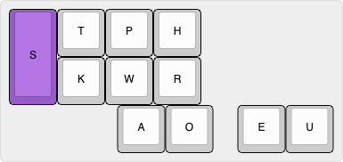
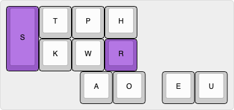
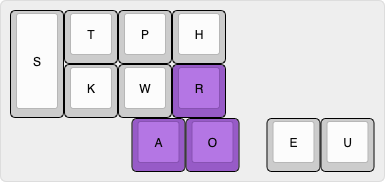
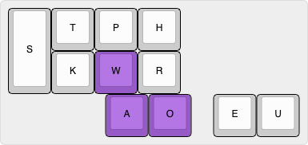
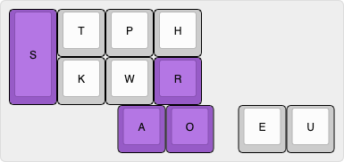

# Emily's Modifier Dictionary 

# very much a WIP and looking for feedback and ideas - will change a lot and quickly :) 
## much of the documentation is missing as the design in finalised, please ask or look into the python file itself to see what the strokes are (especially the symbols)

## Design

- type every character with any mixture of modifiers available
- do it all in one stroke

## Section

There are 3 main sections:
1. character
2. switcher
3. modifiers
4. unique ending 

### character

Character input is based on fingerspelling and takes up the whole left hand and vowels.
As I use magnum, and expect most others to use plover, you can specify exactly how fingerspelling works in your dictionary with a variable. 

| fingerspelling pattern                | letter  |
|---------------------------------------|---------|
|  | S       |
|  | V       |

When `AO` is held, as that's not valid fingerspelling, the bottom row of the left hand (`SKWR`) will turn into binary number input from 0 to 9.

| binary number pattern                 | number  |
|---------------------------------------|---------|
|  | 1       |
|  | 2       |
|  | 9       |

If `TP` (`F`) is also held, the number input will specify function keys, for the likes of `alt-F4`.

| binary function number pattern | function |
|--------------------------------|----------|
|       | F5       |
|     | F11      |

### switcher

when `*` is used, the left bank will switch from fingerspelling letters, to a reflected and modified symbol dictionary. 
This will apply modifiers to all sorts of symbols in addition to just the letters and numbers. 

| symbol pattern                                 | output |
|------------------------------------------------|--------|
|  | `!`    |
|           | `#`    |

### modifiers 

`FRPB` are used to specify the modifier keys to be used against the selected character. 

- `R` = `shift`
- `F` = `control`
- `B` = `alt`
- `P` = `super`

These can all be used to add on the relevant modification as needed, with no limit.

| modifier pattern                            | modifier  |
|---------------------------------------------|-----------|
|  | `control` |
|      | `shift`   |
|          | `alt`     |
|      | `super`   |

### unique ending

This stroke is used to uniquely identify a dictionary entry chord from any other chord.
By default this is `-LTZ`, this should be strokes with pinky on the `-Z` and ring finger for `-LT`.
Due to physical and practical limitations, this key combination is both difficult to press, and also will generate clashes. 
Please check with your dictionary to see what clashes may occur, and potentially change what this stroke is.
With Magnum as I currently use it, the `-LTZ` stroke clashes with only 71 entries, most of which are misstroke entries, so I don't have to worry about it too much. 

